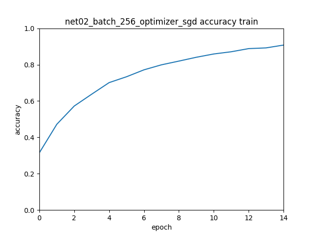
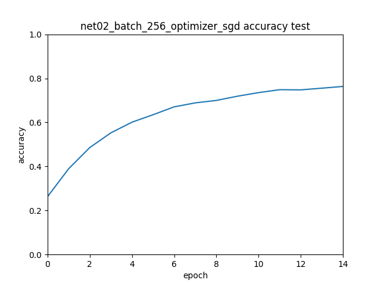
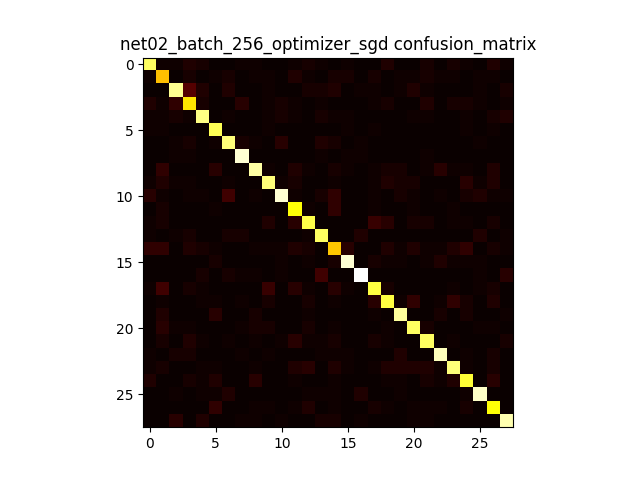

Piotr Szulc

# Task 1

* Found errors in train dataset (like another actor from same show)
* Had dificulty guessing which actor is on picture due to lighting
* Multiple persons on photo
* Pictures of actor when he was much younger, had different hairstyle etc.
* My guess: 85%

# Task 2
* Didn't implement my own BatchNorm2d
* Architecture of neural network that passed 75%:
    models/net02.py
    
    * Conv2d(3, 32, 3)
    * Conv2d(32, 64, 3)
    * Conv2d(64, 128, 5)
    * Conv2d(128, 128, 5)
    * Linear(128 * 12 * 12, 2048)
    * Linear(2048, CLASSES_COUNT)

# Task 3 
* What is the accuracy and average loss of your network? Is loss different on test and
train?
    Not sure about comparing loss on test and train (different sizes);

    Net02, batch size 256, after 15 epochs

    Train
    

    Test
    

    Train accuracy is much higher than test
    0.9077678571428571 vs 0.7633477633477633

    

* What is the impact of batch size on accuracy?
    Batch size: 1 we reach faster better accuracy than in batch size: 256. After 15 epochs they have similiar accuracy, Batch size: 1 has slightly better accuracy (< 1.5 p%)

* What is the impact of batch normalization on accuracy and learning speed?

    ** Batch size: 256

    Without batch normalization accuracy starts terrible (4% accuracy on test after 1 epoch) and after 15 epochs 23%

    ```
    epoch 7/7
    time per epoch: 44.270503759384155 seconds
    Accuracy of the network on the test images: 10 %
    ```

* What optimizer gives the best results?

    * optimizer = optim.SGD(net.parameters(), lr=0.001, momentum=0.9) best
    * Adam not enough memory on cuda
    * Adagrad - 0.5696248196248196

# Task 4

    Accuracy of 0000210 : 75 %
    Accuracy of 0829576 : 63 %
    Accuracy of 1433588 : 82 %
    Accuracy of 1374980 : 63 %
    Accuracy of 1312575 : 78 %
    Accuracy of 1015262 : 76 %
    Accuracy of 0221043 : 80 %
    Accuracy of 0005527 : 83 %
    Accuracy of 0010075 : 85 %
    Accuracy of 0004266 : 74 %
    Accuracy of 0515116 : 85 %
    Accuracy of 0068338 : 67 %
    Accuracy of 0000204 : 72 %
    Accuracy of 0001774 : 79 %
    Accuracy of 0688132 : 55 %
    Accuracy of 0424060 : 82 %
    Accuracy of 0358316 : 87 %
    Accuracy of 0006969 : 67 %
    Accuracy of 0177896 : 68 %
    Accuracy of 0221046 : 82 %
    Accuracy of 0000439 : 74 %
    Accuracy of 1415323 : 74 %
    Accuracy of 0004770 : 84 %
    Accuracy of 0519456 : 83 %
    Accuracy of 0913488 : 73 %
    Accuracy of 0010736 : 85 %
    Accuracy of 0000662 : 66 %
    Accuracy of 0004937 : 84 %

    0829576 Kristen Stewart: many mistakes in train set; different hairstyles; younger age

    0688132 Can't figure this out...
    

